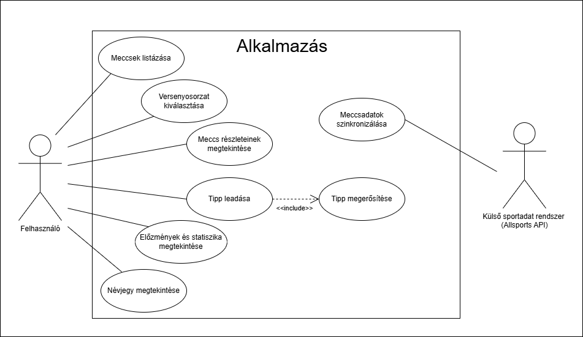
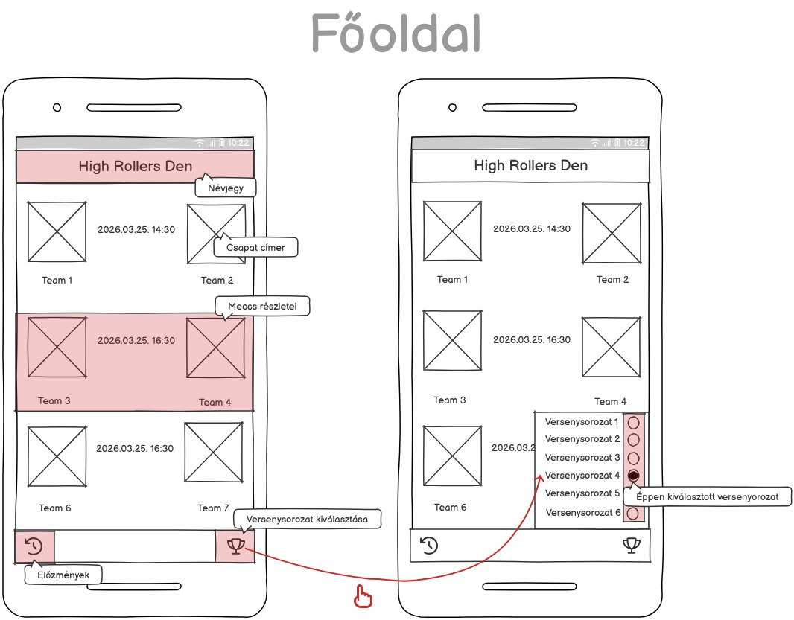
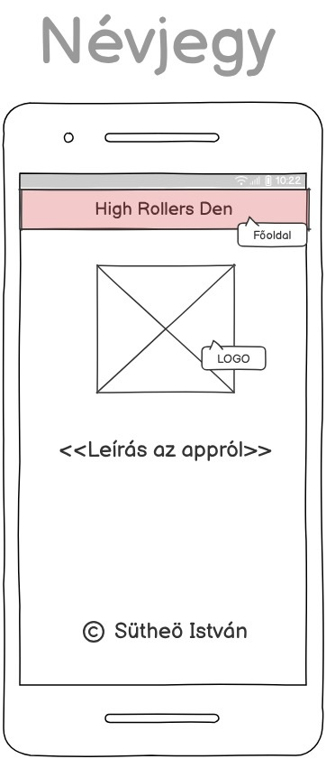
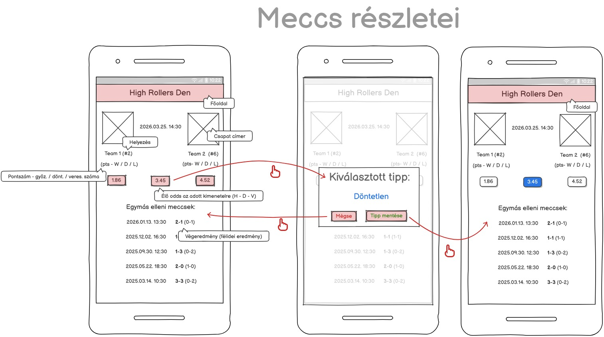
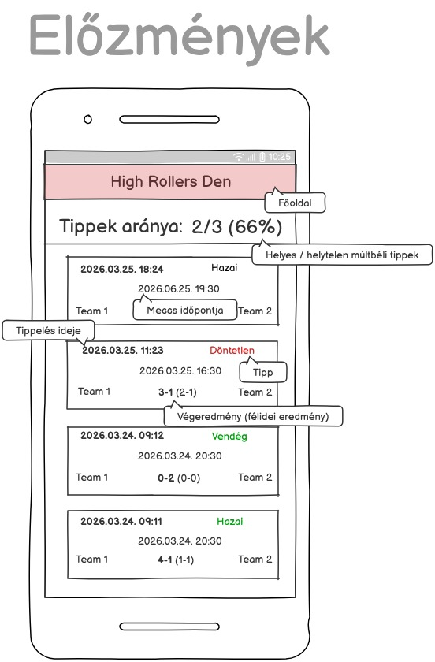
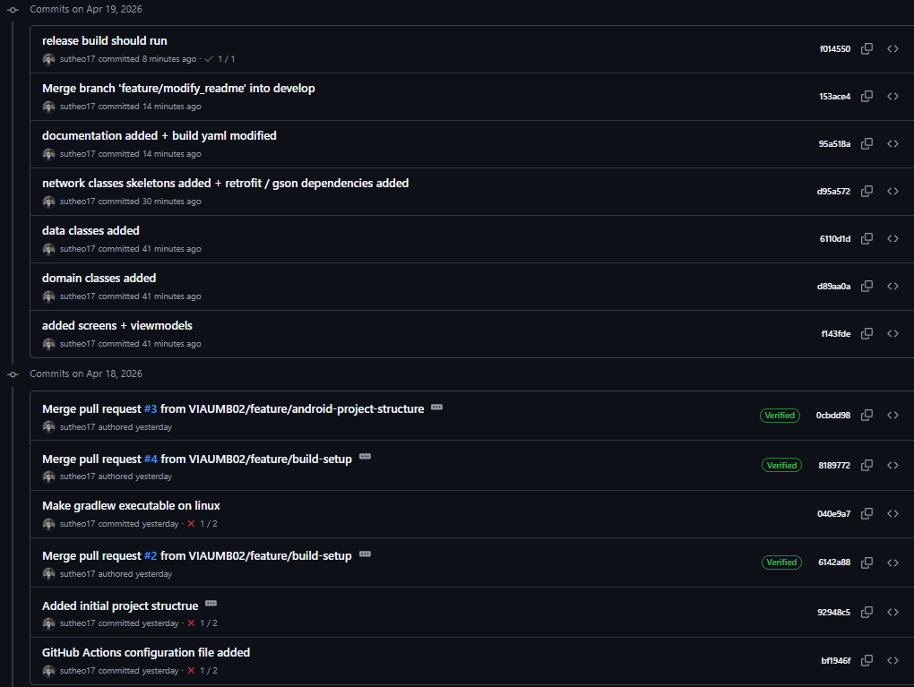
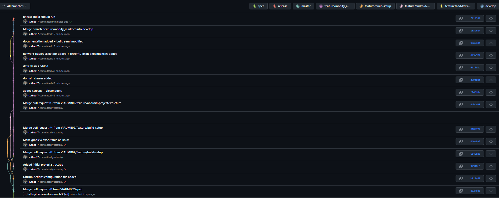
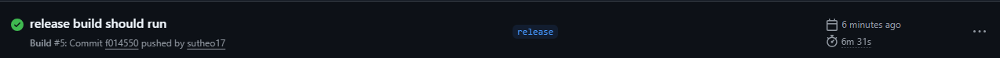

# Házi feladat specifikáció

## Mobilszoftver Laboratórium
### 2026 tavaszi félév
### Sütheö István - (XOBJYX)
### Laborvezető: Sik Dávid

## High Rollers Den

## Bemutatás

Egy sportfogadó – azon belül labdarúgásra specializált – alkalmazás megvalósítása a cél. Én magam is szívesen követem az egyes sporteseményeket, valamint érdekel a sportfogadás világa is. A célközönség olyan felhasználók lennének, akik hozzám hasonlóan érdeklődnek a sport iránt, és valódi pénzügyi kockázat nélkül szeretnének tippelni a mérkőzések kimenetelére. Az alkalmazás számukra lehetőséget biztosít arra, hogy nyomon kövessék nyomon tippjeik eredményességét.

( természetesen csak 18 éven felüliek 😉 )

## Főbb funkciók

A rendszer fő célja, hogy a felhasználó nyomon követhesse az egyes tippjeit és azok helyességét, segítve ezzel a saját tippelési hatékonyságának hosszú távú elemzését.

### Actorok

- **Felhasználó** - Az alkalmazás elsődleges felhasználója, aki böngészi a futball meccseket, tippeket ad le, és statisztikai adatokat tekint meg.
- **Külső sportadat rendszer (AllSports API)** - Meccsek és a csapatok adatait szolgáltatja: időpont, címer, élő odds, tabella helyzete, egymás elleni eredmények, forma, végeredmény.
- **Rendszer** - A belső logika, ami ütemezetten lekéri az adatokat az API-tól, kiszámolja a statisztikákat és kezeli az adatbázist.

### Követelmények

#### Funkcionális

- A rendszer képes legyen meccsadatok lekérésére külső API-ból.
- A felhasználó meg tudja tekinteni a meccsek listáját.
- A felhasználó szűrni tudja a meccseket versenysorozat szerint.
- A felhasználó meg tudja nézni egy meccs részleteit (odds, statisztikák - helyezés, pontszám, forma, egymás elleni meccsek).
- A felhasználó tippet tud leadni (Hazai / Döntetlen / Vendég).
- A rendszer menti a tippeket.
- A felhasználó meg tudja nézni a korábbi tippjeit.
- A rendszer kiszámolja a találati arányt (%).
- A rendszer megjeleníti a félidei és végeredményeket is.
- A felhasználó meg tudja nyitni a névjegy oldalt.

#### Nem funkcionális

- Az adatok betöltése történjen automatikusan.
- Az alkalmazás működjön internetkapcsolat esetén stabilan.
- A felhasználói felület legyen átlátható és könnyen használható.
- Az adatok kezelése legyen megbízható (ne vesszen el tipp).

### Use-casek

#### **1. Meccsadatok szinkronizálása**

**Actor:** Rendszer  
**Leírás:** A rendszer automatikusan frissíti a meccsadatokat külső API-ból.

**Előfeltételek:**
- Internetkapcsolat elérhető  

**Fő folyamat:**
1. A rendszer API hívást indít  
2. Az API visszaadja az adatokat  
3. A rendszer feldolgozza az adatokat  
4. A rendszer frissíti az adatbázist  

**Alternatív ágak:**
- API hiba → újrapróbálkozás vagy hiba naplózása  

**Utófeltételek:**
- Az adatok naprakészek  

---

#### **2. Meccsek listázása**

**Actor:** Felhasználó  
**Leírás:** A felhasználó megtekinti a meccsek listáját.

**Előfeltételek:**
- Az adatok betöltve  

**Fő folyamat:**
1. A felhasználó megnyitja az alkalmazást  
2. A rendszer megjeleníti a meccseket  

**Alternatív ágak:**
- Nincs adat → “Nincs elérhető meccs” üzenet  

**Utófeltételek:**
- A meccslista megjelenik  

---

#### **3. Versenysorozat kiválasztása**

**Actor:** Felhasználó  
**Leírás:** A felhasználó szűri a meccseket ligák vagy kupák szerint.

**Előfeltételek:**
- Meccslista megjelenítve  

**Fő folyamat:**
1. A felhasználó kiválaszt egy ligát  
2. A rendszer frissíti a meccslistát  

**Utófeltételek:**
- Szűrt lista jelenik meg  

---

#### **4. Meccs részleteinek megtekintése**

**Actor:** Felhasználó  
**Leírás:** A felhasználó részletes információkat tekint meg egy meccsről.

**Előfeltételek:**
- Meccs kiválasztva  

**Fő folyamat:**
1. A felhasználó megnyit egy meccset  
2. A rendszer megjeleníti:
   - oddsok  
   - statisztikák  
   - egymás elleni eredmények  

**Alternatív ágak:**
- Hiányos adat → részleges megjelenítés  

**Utófeltételek:**
- A részletek láthatók  

---

#### **5. Tipp leadása**

**Actor:** Felhasználó  
**Leírás:** A felhasználó tippet ad le egy meccs kimenetelére.

**Előfeltételek:**
- Meccs részletei meg vannak nyitva  
- A meccs még nem kezdődött el  

**Fő folyamat:**
1. A felhasználó kiválaszt egy kimenetelt  
2. A rendszer megerősítést kér  
3. A felhasználó jóváhagyja  
4. A rendszer elmenti a tippet  

**Alternatív ágak:**
- Megszakítás → nincs mentés  
- Mentési hiba → hibaüzenet  

**Utófeltételek:**
- A tipp eltárolásra kerül  

---

#### **6. Előzmények és statisztika megtekintése**

**Actor:** Felhasználó  
**Leírás:** A felhasználó megtekinti korábbi tippjeit és eredményességét.

**Előfeltételek:**
- Léteznek mentett tippek  

**Fő folyamat:**
1. A felhasználó megnyitja a statisztika oldalt  
2. A rendszer lekéri a tippeket  
3. A rendszer kiszámolja a találati arányt  
4. A rendszer megjeleníti az adatokat  

**Alternatív ágak:**
- Nincs adat → “Nincs még tipped” üzenet  

**Utófeltételek:**
- A statisztika megjelenik  

---

#### **7. Névjegy megtekintése**

**Actor:** Felhasználó  
**Leírás:** A felhasználó megtekinti az alkalmazás információit.

**Fő folyamat:**
1. A felhasználó megnyitja a névjegy oldalt  
2. A rendszer megjeleníti az információkat  

**Utófeltételek:**
- Az információk láthatók  

### User storyk

| ID | Szerep | Cél | Indok | Use-case |
| ----------- | ----------- | ----------- | ----------- | ----------- |
| US1 | Felhasználó | látni akarom a korábbi tippjeim listáját | hogy elemezhessem a hibáimat vagy a sikereimet | 6 | 
| US2 | Felhasználó | látni akarom a pontos százalékos találati arányomat | hogy objektív képet kapjak a tippelési képességemről | 6 |
| US3 | Felhasználó | látni akarom a félidei és végeredményeket a tippjeim mellett | hogy lássam, mennyire volt "szoros" vagy egyértelmű a kimenetel. | 6 |
| US4 | Felhasználó | megerősítést akarok kapni a tipp mentése előtt | hogy elkerüljem a véletlen félrekattintásból adódó statisztikai romlást | 5 |
| US5 | Felhasználó | szűrni akarok ligákra | hogy csak azokat a meccseket lássam, amik érdekelnek | 3 |
| US6 | Felhasználó | látni akarom az egymás elleni eredményeket | egymás elleni (H2H) eredményeket	hogy ne csak megérzésre, hanem múltbeli adatokra alapozzam a tippem | 4 |
| US7 | Felhasználó | látni akarom az élő oddsokat | hogy lássam, a bukik kit tartanak esélyesebbnek | 4|
| US8 | Felhasználó | látni akarom a névjegyet és az alkalmazás információit | hogy tudjam, ki készítette az appot, és tisztában legyek az app használatával | 7 |

## Képernyőtervek

### A képernyőterveken az interaktálható területek pirossal vannak jelölve.

### [Főoldal](https://share.balsamiq.com/c/mxezdYZHA6EynAeMxSuE9V.jpg)

### [Névjegy](https://share.balsamiq.com/c/n1dLqQf8QiTCdiXubUgKcp.jpg)

### [Meccs részletei](https://share.balsamiq.com/c/9n8a772M3rgQFzFWs7sYZw.jpg)

### [Előzmények](https://share.balsamiq.com/c/5GmRcVSnCNckywfBEjJHbZ.jpg)

---

## Labor 2 - Architektúra és környezet

### Választott architektúra: MVVM és Clean Architecture

Az alkalmazás fejlesztése során a Google által ajánlott modern Android fejlesztési irányelveket követtem, ötvözve az **MVVM (Model-View-ViewModel)** mintát a **Clean Architecture** rétegzési elveivel.

#### Az architektúra felépítése

Az alkalmazás kódja három fő logikai rétegre tagolódik a projekt struktúrájában:

1.  **Data réteg (`data/`):**
    * Felelős az adatok eléréséért (hálózat, helyi adatbázis).
    * Tartalmazza a **Repository** implementációkat, amelyek elrejtik az adatforrás (Room ORM vagy Retrofit API) komplexitását.
    * Itt találhatók a DAO-k, Entitások és a Hilt modulok (DatabaseModule, NetworkModule).

2.  **Domain réteg (`domain/`):**
    * Az alkalmazás központi része, amely mentes minden Android-specifikus függőségtől.
    * Tartalmazza az üzleti modelleket és a **Use Case**-eket (pl. `GetMatchesUseCase`), amelyek egy-egy konkrét üzleti folyamatot reprezentálnak.

3.  **UI réteg (`ui/`):**
    * **View:** Jetpack Compose alapú deklaratív felület.
    * **ViewModel:** Kezeli a UI állapotát (State) és kommunikál a Domain réteggel, biztosítva az adatok túlélését konfigurációváltáskor.
    * **Navigation:** Típusbiztos navigáció `Screen` sealed class használatával.

#### A választás indoklása

* **Felelősségek szétválasztása:** A rétegzett felépítés biztosítja, hogy a UI és az adatbázis-logika ne keveredjen, ami megkönnyíti a hosszú távú karbantartást.
* **Tesztelhetőség:** A függőségek (pl. Repository-k) injektálása miatt a ViewModel-ek és Use Case-ek egységtesztekkel izoláltan ellenőrizhetőek.
* **Dagger-Hilt (DI):** A DI keretrendszer automatizálja az objektumok életciklus-kezelését, csökkentve a "boilerplate" kódot és a manuális példányosításból eredő hibákat.
* **Skálázhatóság:** A struktúra lehetővé teszi új funkciók hozzáadását a meglévő kód módosítása nélkül (Open/Closed elv).

### Git Flow használata

A Git Flow módszertant alkalmaztam a forráskód kezelésére és a fejlesztési folyamat strukturálására.

Volt 4 darab feature branchem:

* **feature/build-setup:** A build yaml fájl hozzáadása.
* **feature/android-project-structure:** Az android projekt létrehozása a megfelelő stuktúrával.
* **feature/add-kotlin-classes:** Kotlin osztályfájlok hozzáadása, néhányhoz kezdetleges üzleti logika hozzáadva.
* **feature/modify_readme** Architektúra leírása.

Ezeket mind bemergeltem a develop branchre, majd a végén egy release branchel leágaztam a develop branchről és ezen már csak a dokumentációt módosítottam, majd nyitottam egy PR-t.

**!!! Sajnos eleinte a PR-okkal mergeltem be a feauture brancheket a developra, hogy a buildet teszteljem,  ezért warning-ot dobott az automata evaluator eszköz (hiszen túl sokszor lefutott az evalution actions), ezért elnézést kérek. Utánna már kézzel mergeltem, mert a release branchre is kiterjesztettem a buildelést. Remélem ez nem jár pontlevonással.**

Commitok:

Commit gráf:

### CI/CD és Build folyamat

A projekt folyamatos integrációját a **GitHub Actions** biztosítja. Minden pull request esetén automatikus build és tesztelési folyamat fut le, garantálva a kód minőségét.

Sikeres build:

---

## Labor 3 - Hálózat és adatbázis

### Hálózati réteg (Retrofit & DI)
- **MatchApi**: Interfész, amely az AllSportsAPI hívásait definiálja a `met` paraméter alapú polimorfizmus kezelésével.
- **FootballDtos**: Adatátviteli objektumok, amelyek a hálózati JSON válaszokat képezik le Kotlin osztályokra.
- **NetworkModule**: Hilt modul, amely Singletonként szolgáltatja a Retrofit klienst és az Api service-t.
- **api.yaml (git könyvtár gyökerében)**: API leíró konfigurációs fájl.

### ORM adatréteg (Room & DI)
- **MatchEntity**: A mérkőzések perzisztens tárolásáért felelős entitás.
- **BetEntity**: A felhasználói tippek tárolására szolgáló entitás. A választott architektúra szerint redundánsan tárolja a meccsadatokat, így az előzmények akkor is konzisztensek maradnak, ha a meccslista frissül.
- **MatchDao & BetDao**: Adathozzáférési objektumok, amelyek SQL lekérdezésekkel (Insert, Query, Delete) kezelik az adatokat.
- **AppDatabase**: A Room adatbázis központi konfigurációs osztálya.
- **DatabaseModule**: Hilt modul, amely az adatbázis példányosításáért és a DAO-k injektálásáért felel.

### Repository és Mapper
- **MatchRepository**: Az alkalmazás egyetlen adatforrása (Single Source of Truth). Összefogja a hálózati szinkronizációt és a helyi adatbázis műveleteket.
- **Mapper (asEntity)**: Kiterjesztett függvény, amely a hálózati modelleket (DTO) átalakítja adatbázis entitásokká, biztosítva a rétegek közötti izolációt.    